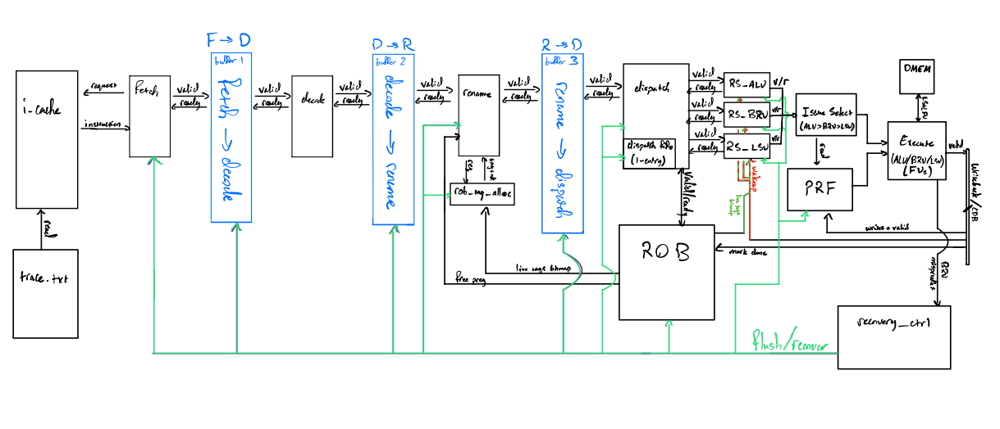

# Out-of-Order RISC-V CPU

This repository contains our SystemVerilog implementation of the ECE 189 Out-of-Order (OoO) RISC-V CPU project.

## Repository layout

- `src/` — main RTL (SystemVerilog)
- `tb/` — testbenches and simulation harnesses
- `src/extra/` — older phases / legacy / archived modules (kept for reference)
- `waveforms/` / `test_traces/` — waveform dumps and trace outputs used for debugging

## How to run (Vivado simulation)

1. Open **Vivado**
2. Create a new project (or open your existing one)
3. Add:
   - `src/` as **Design Sources**
   - `tb/` as **Simulation Sources**
4. Set the appropriate testbench as the simulation top (e.g., `core_tb.sv`)
5. Run **Behavioral Simulation**
6. Open the waveform viewer to inspect dumps (if enabled in your TB)

### Memories / traces

- Instruction memory is initialized from the provided traces (.txt files).
- See the icache.sv and testbench for the exact file names/paths used in your current setup.

## Design overview

## Phase breakdown (what’s implemented)

### Phase 0 — Foundational infrastructure
Reusable building blocks (FIFO, priority selection/encoders, skid buffering helpers) used throughout later phases.

### Phase 1 — Frontend integration
Fetch + decode integrated with instruction memory / I-cache model and stage-to-stage handshaking.

### Phase 2 — Rename + backend data structures
Rename (RAT + free list), PRF, dispatch routing, ROB allocation/commit plumbing, reservation stations + dependency tracking.

### Phase 3 — Execute + writeback + commit (full pipeline)
ALU/BRU/LSU functional units, CDB arbitration, PRF writeback, RS wakeup, ROB completion, and in-order commit/free.

### Phase 4 — Recovery (attempted; currently nonfunctional)
Goal: recover from branch mispredictions (baseline predictor: “not-taken”), flush/squash younger work, and resume at the correct target.